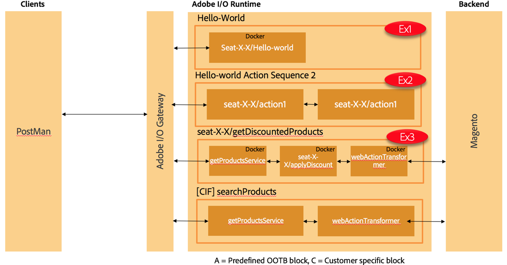

Exercise 3 - Create a CIF Package with Action Sequence
========================================================

## Objective


## Tasks

```diff
- **WARNING: PLEASE REPLACE seat-{YOUR_FIRSTNAME}-{YOUR_LASTNAME} with your firstname and lastname: seat-john-doe**
```

1. If you don't have a package `seat-john-doe` created please follow steps in [Exercise 1](../exercise-01/tutorial-01-hello-world.md) or [Exercise 2](../exercise-02/tutorial-02-hello-world-sequence.md)

2. Create Action 

    ```ruby
    wsk action create seat-{YOUR_FIRSTNAME}-{YOUR_LASTNAME}/applyDiscount applyDiscount.js --param discountCategory 17
    ```

	For the "discountCategory" parameter we provide a default value, which is used if category is not provided as a URL parameter. The category used here is Men's Coats. See step 6.

	Example:

    ```ruby
    wsk action create seat-john-doe/applyDiscount applyDiscount.js --param discountCategory 17
    ```

3. Create a Action Sequence

	```ruby
    wsk action create seat-{YOUR_FIRSTNAME}-{YOUR_LASTNAME}/getDiscountedProducts --sequence "commerce-cif-magento-product@latest/searchProductsService,seat-{YOUR_FIRSTNAME}-{YOUR_LASTNAME}/applyDiscount,commerce-cif-magento-common@latest/webActionTransformer" --web true
    ```

    Expected output
    ```ruby
    ok: created action seat-X-X/getDiscountedProducts
    ```
    
    The seqeunce uses two actions (`searchProductsService` & `webActionTransformer`) from the `commerce-cif-magento-product@latest` and `commerce-cif-magento-common@latest` packages.

    You can run
    ```ruby
    wsk package get /YOUR_NAMESPACE/commerce-cif-magento-product@latest
    ```
    to see which OpenWhisk actions are contained in that package.

    Learn more about [packages](https://github.com/apache/incubator-openwhisk/blob/master/docs/packages.md) &  [web actions](https://github.com/apache/incubator-openwhisk/blob/master/docs/webactions.md)

4. Check if the action sequence is created

	```ruby
    wsk action list
    ```

    Expected output
   
    ```ruby 
    actions
    /YOUR_NAMESPACE/seat-X-X/applyDiscount                                private nodejs:6
    /YOUR_NAMESPACE/seat-X-X/hello-world                                  private nodejs:6
    /YOUR_NAMESPACE/seat-X-X/getDiscountedProducts                        private sequence
    /YOUR_NAMESPACE/magento/searchProducts                               private sequence
    /YOUR_NAMESPACE/magento/postShippingMethod                           private sequence
    /YOUR_NAMESPACE/magento/postPayment                                  private sequence
    ...
    ```

5. Check if the newly created sequence has the right actions configured 

	```ruby
    wsk action get seat-{YOUR_FIRSTNAME}-{YOUR_LASTNAME}/getDiscountedProducts
    ```

   Expected output
   
   ```ruby 
   ok: got action seat-john-doe/getDiscountedProducts
   {
       "namespace": "YOUR_NAMESPACE/seat-X-X",
       "name": "getDiscountedProducts",
       "version": "0.0.1",
       "exec": {
           "kind": "sequence",
           "components": [
               "/YOUR_NAMESPACE/commerce-cif-magento-product@latest/searchProductsService",
               "/YOUR_NAMESPACE/seat-X-X/applyDiscount",
               "/YOUR_NAMESPACE/commerce-cif-magento-product@latest/webActionTransformer"
           ]
       },
       "annotations": [
           {
               "key": "web-export",
               "value": true
           },
           {
               "key": "raw-http",
               "value": false
           },
           {
               "key": "final",
               "value": true
           },
           {
               "key": "exec",
               "value": "sequence"
           }
       ],
       "parameters": [
           {
               "key": "_actions",
               "value": [
                   "/YOUR_NAMESPACE/commerce-cif-magento-product@latest/searchProductsService",
                   "/YOUR_NAMESPACE/seat-X-X/applyDiscount",
                   "/YOUR_NAMESPACE/commerce-cif-magento-product@latest/webActionTransformer"
               ]
           }
       ],
       "limits": {
           "timeout": 60000,
           "memory": 256,
           "logs": 10
       },
       "publish": false
   }
   
   ```
6. Open PostMan and run the following command and see the response (as you can see discount is applied)

	**Sample call 1**: apply discount to default category - men's coats
	```ruby
    GET https://runtime.adobe.io/api/v1/web/YOUR_NAMESPACE/seat-{YOUR_FIRSTNAME}-{YOUR_LASTNAME}/getDiscountedProducts.http?text=jacket
    ```
	discount is applied to all product in the men's coat category, product name is suffied as well

	**Sample call 2**: apply discount to default category provide as param
	```ruby
    GET https://runtime.adobe.io/api/v1/web/YOUR_NAMESPACE/seat-{YOUR_FIRSTNAME}-{YOUR_LASTNAME}/getDiscountedProducts.http?text=shirt&discountCategory=15
    ```
	discount is applied to all product in the men's > shirts category, product name is suffixed as well

7. **Bonus**: Debug I/O Runtime actions

    Run the OpenWhisk Cli to poll all action invocation messages
    ```ruby
    wsk activation poll
    ````

    Re-run URL calls from Step 6.

    Expected output: get information and logging information from you actions

    Hint: you can also do a combination of `wsk activation list` and `wsk activation get <id>` to get action invocation details.

8. Overall outcome


